# 🔄 Flow Machine Architecture

**A sophisticated flow execution engine for orchestrating interconnected node workflows with dynamic data sharing and dependency management.**

---

## 📋 Table of Contents

- [🎯 Overview](#-overview)
- [🏗️ Core Architecture](#️-core-architecture)
- [🔄 Flow Execution Phases](#-flow-execution-phases)
- [📊 Mermaid Diagrams](#-mermaid-diagrams)
- [💡 Examples](#-examples)
- [🔧 Technical Details](#-technical-details)

---

## 🎯 Overview

The Flow Machine is a **two-phase execution engine** designed to orchestrate complex workflows composed of interconnected nodes. It provides:

- **🔗 Dynamic Node Discovery**: Automatically discovers and includes upstream dependencies
- **📊 Shared Session State**: Enables data sharing between nodes during execution
- **⚡ Two-Phase Execution**: Separate prepare and execute phases for optimal performance
- **🔄 Dependency Management**: Topological sorting ensures proper execution order
- **📈 Flexible Data Sources**: Supports both database and ReactFlow session modes

---

## 🏗️ Core Architecture

### 🏛️ Main Components

| Component | Responsibility |
|-----------|----------------|
| **FlowMachine** | Main orchestrator handling execution flow |
| **FlowDataService** | Data access layer with dual-mode support |
| **BaseNodeHandler** | Abstract handler for custom node implementations |
| **FlowGraph** | Graph representation with adjacency lists |
| **FlowSessionState** | Shared state management during execution |

### 🔄 Execution Model

```
Target Node Selection → Graph Discovery → Prepare Phase → Execute Phase
```

---

## 🔄 Flow Execution Phases

### 1️⃣ **Prepare Phase**
- **Purpose**: Data collection and dependency preparation
- **Scope**: All direct upstream nodes
- **Actions**: 
  - Validate node configurations
  - Collect required data
  - Prepare execution context

### 2️⃣ **Execute Phase**  
- **Purpose**: Core workflow execution
- **Scope**: Target node only
- **Actions**:
  - Execute main node logic
  - Update session state
  - Generate final results

---

## 📊 Mermaid Diagrams

### 🏗️ System Architecture

```mermaid
graph TB
    subgraph "🎯 FlowMachine Core"
        FM[FlowMachine]
        FDS[FlowDataService]
        FM --> FDS
    end
    
    subgraph "📊 Data Layer"
        DB[(Database)]
        RF[ReactFlow Session]
        FDS --> DB
        FDS --> RF
    end
    
    subgraph "🔧 Node Handlers"
        LLM[LLM Handler]
        PROMPT[Prompt Handler]
        MSG[Message Handler]
        SCHEMA[Schema Handler]
        VECTOR[Vector DB Handler]
    end
    
    FM --> LLM
    FM --> PROMPT
    FM --> MSG
    FM --> SCHEMA
    FM --> VECTOR
    
    subgraph "💾 State Management"
        SESSION[Session State]
        EXEC[Node Executions]
        FM --> SESSION
        FM --> EXEC
    end
```



### ⚡ Execution Flow

```mermaid
sequenceDiagram
    participant Client
    participant FlowMachine as 🔄 FlowMachine
    participant DataService as 📊 FlowDataService
    participant Handler as 🔧 NodeHandler
    participant State as 💾 SessionState
    
    Note over Client,State: 1️⃣ Preparation Phase
    Client->>FlowMachine: prepare(targetNodeId, initialState)
    FlowMachine->>DataService: getConnectedNodes(targetNodeId)
    DataService-->>FlowMachine: FlowGraph
    
    loop For Each Direct Upstream Node
        FlowMachine->>Handler: prepare(node, context)
        Handler->>State: setState(key, value)
        Handler-->>FlowMachine: prepareResult
    end
    
    Note over Client,State: 2️⃣ Execution Phase  
    Client->>FlowMachine: execute()
    FlowMachine->>Handler: execute(targetNode, context)
    Handler->>State: getState(key) / setState(key, value)
    Handler-->>FlowMachine: executeResult
    FlowMachine-->>Client: FlowRunState
```



### 🔄 State Flow Diagram

```mermaid
stateDiagram-v2
    [*] --> IDLE: FlowMachine Created
    
    IDLE --> PREPARING: prepare() called
    PREPARING --> PREPARED: All upstream nodes prepared
    PREPARING --> FAILED: Preparation error
    
    PREPARED --> RUNNING: execute() called
    RUNNING --> COMPLETED: Target node executed
    RUNNING --> FAILED: Execution error
    
    FAILED --> [*]: Reset required
    COMPLETED --> [*]: Flow finished
    
    note right of PREPARING
        📥 Data Collection
        ✅ Node Validation
        🔗 Dependency Resolution
    end note
    
    note right of RUNNING
        ⚡ Target Node Execution
        📊 State Updates
        📤 Result Generation
    end note
```



---

## 💡 Examples

### 🎯 Example 1: Simple LLM Flow

**Scenario**: Execute an LLM node with a prompt dependency

```typescript
// Setup flow machine
const flowMachine = new FlowMachine()
flowMachine.registerNodeHandler(new PromptNodeHandler())
flowMachine.registerNodeHandler(new LLMNodeHandler())

// Execute flow
await flowMachine.prepare('llm-node-1', { 
  userInput: 'What is AI?' 
})

const result = await flowMachine.execute()
console.log('LLM Response:', result.nodeExecutions.get('llm-node-1')?.result)
```

**Flow Structure**:
```
[Prompt Node] ──→ [LLM Node] (target)
```

### 🎯 Example 2: Complex Chat Flow

**Scenario**: Process a message through multiple data sources and generate a response

```typescript
const flowMachine = new FlowMachine()

// Register all required handlers
flowMachine.registerNodeHandler(new VectorDatabaseHandler())
flowMachine.registerNodeHandler(new PromptNodeHandler()) 
flowMachine.registerNodeHandler(new LLMNodeHandler())
flowMachine.registerNodeHandler(new MessageNodeHandler())

// Execute with context
await flowMachine.prepare('message-node-1', {
  query: 'Explain quantum computing',
  conversationId: 'chat-123'
})

const result = await flowMachine.execute()
```

**Flow Structure**:
```
[Vector DB] ──┐
              ├──→ [Prompt Node] ──→ [LLM Node] ──→ [Message Node] (target)
[CSV Data] ───┘
```

### 🎯 Example 3: Agent Workflow

**Scenario**: Basic agent with tool access and schema validation

```typescript
const flowMachine = new FlowMachine()

// Multi-step agent flow
await flowMachine.prepare('agent-node-1', {
  task: 'Analyze sales data and generate report',
  tools: ['calculator', 'chart-generator']
})

const result = await flowMachine.execute()

// Access intermediate results
const schemaResult = result.nodeExecutions.get('schema-node-1')?.result
const toolResult = result.nodeExecutions.get('tool-node-1')?.result
const finalResult = result.nodeExecutions.get('agent-node-1')?.result
```

**Flow Structure**:
```
[Schema Node] ──┐
                ├──→ [Tool Node] ──→ [Basic Agent] (target)
[CSV Data] ─────┘
```

---

## 🔧 Technical Details

### 🏛️ Key Classes

#### FlowMachine
```typescript
class FlowMachine {
  // Node handler registry
  private nodeHandlers: Map<FlowNodeTypeEnum, BaseNodeHandler>
  
  // Core methods
  async prepare(targetNodeId: string, initialState?: Record<string, unknown>): Promise<void>
  async execute(): Promise<FlowRunState>
  
  // State management
  getSessionState(key?: string): unknown
  setSessionState(key: string, value: unknown): void
}
```

#### FlowDataService
```typescript
class FlowDataService {
  // Dual-mode support
  private mode: 'database' | 'session'
  
  // Factory methods
  static forDatabase(): FlowDataService
  static forSession(reactFlowInstance): FlowDataService
  
  // Core data access
  async getConnectedNodes(startNodeId: string): Promise<FlowGraph>
}
```

### 🔄 Node Handler Interface

```typescript
abstract class BaseNodeHandler<TPrepareResult, TExecuteResult> {
  abstract nodeType: FlowNodeTypeEnum
  
  // Two-phase execution
  prepare?(node: FlowNode, context: FlowExecutionContext): Promise<TPrepareResult>
  execute?(node: FlowNode, context: FlowExecutionContext): Promise<TExecuteResult>
  
  // Lifecycle hooks
  validate?(node: FlowNode): boolean
  onBeforeExecute?(node: FlowNode, context: FlowExecutionContext): Promise<void>
  onAfterExecute?(node: FlowNode, result: unknown, context: FlowExecutionContext): Promise<void>
  onError?(node: FlowNode, error: Error, context: FlowExecutionContext): Promise<void>
}
```

### 📊 State Management

**FlowSessionState** provides shared state across all nodes:
- **Data Storage**: `Map<string, unknown>` for flexible data types
- **Step Tracking**: Automatic increment during execution
- **Accessor Methods**: `get()`, `set()` for easy state access

**FlowRunState** tracks execution progress:
- **Status**: `IDLE` → `RUNNING` → `COMPLETED`/`FAILED`
- **Node Executions**: Individual node status and results
- **Error Handling**: Detailed error information and stack traces

### 🌐 Graph Processing

**Topological Sorting**: Ensures dependencies execute before dependents
**Adjacency Lists**: Efficient graph traversal and dependency resolution  
**Circular Dependency Detection**: Prevents infinite loops in node graphs

---

*Built with ❤️ for robust, scalable workflow orchestration*
