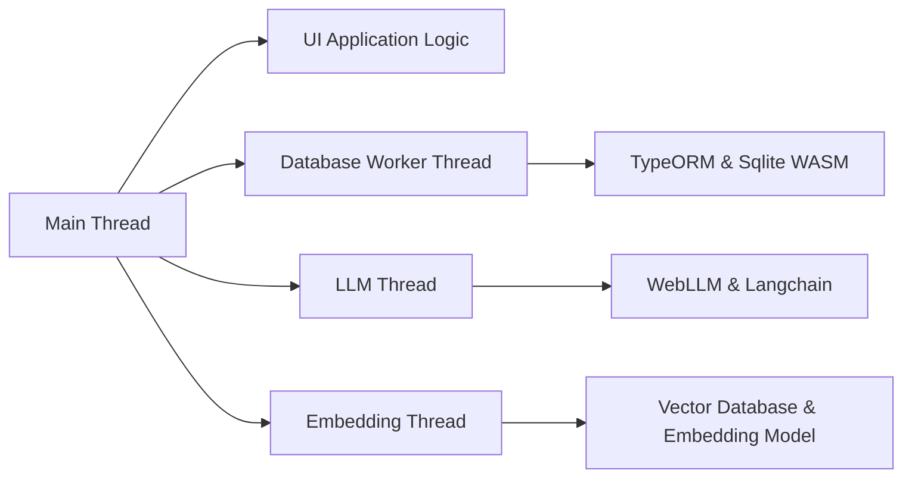

# NoLLM Chat

Our project seeks to change how people interact with AI by offering a platform that improves upon typical LLM interactions. We aim to make it easy for everyone to explore AI technologies directly in their web browsers. By providing a more flexible and visual interface, users can engage with language models in a way that enhances their experience and creativity, moving beyond just chat interactions.

## Vision

- **Beyond LLM**: Our platform offers more than standard language model interactions, providing a rich AI experience that includes learning and adaptability.

- **Making AI Accessible**: We aim to make AI available to everyone, not just experts or large companies, by removing barriers and democratizing access to advanced AI technologies.

- **Supporting Education**: Our platform is a tool for students, educators, and enthusiasts to explore and understand AI, inspiring future innovators.

- **Adaptable and Scalable**: Designed to grow with the user, our platform supports both simple and complex AI models, adapting to your needs.

- **Encouraging Collaboration**: By fostering an open-source community, we promote collaboration, idea sharing, and contributions to the development of AI technology.

## Intro


## Technology Stack

- **Vite**: Fast and modern build tool for web projects.
- **React**: A popular JavaScript library for building user interfaces.
- **Vector Database**: Efficiently manage and query vector data for AI models.
- **WebLLM**: Run large language models in the browser without server dependencies.

## Project Structure

```
src/
│
├── assets/         # Static assets like images and fonts
├── components/     # Reusable React components
├── constants/      # Constant values and configuration settings
├── contexts/       # React context providers for global state management
├── css/            # Styling files (CSS or preprocessor files)
├── hooks/          # Custom React hooks
├── i18n/           # Internationalization setup and resources
├── lib/            # Utility libraries and third-party integrations
├── pages/          # Page components for different routes
├── services/       # API calls and service functions
├── states/         # State management files (e.g., Zustand)
├── utils/          # Utility functions and helpers
│
├── App.tsx         # Main application component
├── main.tsx        # Entry point of the application
└── routes.tsx      # Route configurations
```

## Project Architecture

The architecture of the application is designed to efficiently handle different tasks by dividing them into separate threads. This ensures smooth operation and responsiveness of the UI while managing complex processes in the background.

* Main Thread: Handles the UI application logic, ensuring a responsive user interface.
* Database Worker Thread: Manages database operations using TypeORM and Sqlite WASM. This thread is responsible for data storage and retrieval without blocking the main UI thread.
* LLM Thread: Dedicated to handling large language model processes using WebLLM and Langchain. This thread manages AI computations and interactions.
* Embedding Thread: Focuses on handling the vector database and embedding models. It processes and manages embeddings for efficient data retrieval and manipulation.




## Getting Started

To get started with the AI Web Assistant, follow these steps:

1. **Clone the Repository**: 
   ```bash
   git clone https://github.com/yourusername/ai-web-assistant.git
   ```
2. **Install Dependencies**:
   ```bash
   cd ai-web-assistant
   npm install
   ```
3. **Run the Development Server**:
   ```bash
   npm run dev
   ```
4. **Open in Browser**: Visit `http://localhost:3000` to start interacting with the AI assistant.

## Contributing

We welcome contributions from the community! Whether it's bug fixes, new features, or documentation improvements, your help is appreciated. Please check our [contribution guidelines](https://github.com/yourusername/ai-web-assistant/blob/main/CONTRIBUTING.md) for more information.

## License

This project is licensed under the MIT License. See the [LICENSE](https://github.com/yourusername/ai-web-assistant/blob/main/LICENSE) file for more details.

## Contact

For questions, feedback, or suggestions, feel free to open an issue on GitHub or contact us at [your-email@example.com](mailto:your-email@example.com).
