# 🚀 NoLLM Chat

**A revolutionary AI interaction platform that enhances traditional LLM experiences with a versatile, visual interface for exploring AI technologies directly in your browser.**

---

## 📋 Table of Contents

- [🎯 Overview](#-overview)
- [✨ Live Demo](#-live-demo)
- [🎥 Features Showcase](#-features-showcase)
- [🎯 Vision](#-vision)
- [🏗️ Project Architecture](#️-project-architecture)
- [🔄 Flow Machine Engine](#-flow-machine-engine)
- [📁 Project Structure](#-project-structure)
- [🛠️ Libraries and Tools](#️-libraries-and-tools)
- [🚀 Getting Started](#-getting-started)
- [🤝 Contributing](#-contributing)
- [📄 License](#-license)
- [📞 Contact](#-contact)

---

## 🎯 Overview

NoLLM Chat revolutionizes AI interaction by providing a platform that goes **beyond basic chat interactions**. It enables users to interact with language models in ways that boost creativity and enrich their experience through:

- **🎨 Visual Interface**: Node-based workflow creation and management
- **🔧 Browser-Based**: Runs locally and free of charge with optional cloud extensions
- **🔄 Workflow Automation**: Create custom AI workflows tailored to your needs
- **📚 Comprehensive Learning**: Interactive tools for LLMs, prompt engineering, and vector databases

## ✨ Live Demo

[](https://app.netlify.com/sites/nollm/deploys)

<p align="center">
    <a href="https://nollm.netlify.app/NoLLMChat">🌐 <strong>Try Live Demo</strong> 🌐</a>
</p>

<p align="center">
    <strong>Development Progress:</strong> [■■■■□□□□□□] 30%
</p>

---

## 🎥 Features Showcase

### 🖼️ **Platform Overview**


### 🎬 **Interactive Demo**


### 💬 **Built-in Chat Application**


### 📝 **Built-in Document Editor**


### 👨‍💻 **Built-in Code Editor with Sandbox**


---

## 🎯 Vision

### 🚀 **Enhanced AI Interaction**
Move beyond traditional LLM chat with a platform offering a more flexible and visual interface. Users can directly edit and guide AI to improve response quality, enabling richer interaction experiences.

### ⚡ **Automated Personal Workflows**  
Empowers users to create custom AI workflows tailored to their needs, enhancing productivity and personalization.

### 🧠 **Comprehensive AI Learning**
Utilize node-based tools that facilitate interaction with and learning about AI technologies. The platform supports LLMs, prompt engineering, function calls, and vector databases, allowing users to experiment and see the impact of different AI components.

### 🆓 **Free and Browser-Based**
Operates locally and free of charge, with the option to extend capabilities using services like OpenAI. This ensures accessibility and ease of use directly from the browser.

---

## 📁 Project Structure

```
src/
│
├── assets/         # Static assets like images and fonts
├── components/     # Reusable React components
├── constants/      # Constant values and configuration settings
├── contexts/       # React context providers for global state management
├── css/            # Styling files (CSS or preprocessor files)
├── hooks/          # Custom React hooks
├── i18n/           # Internationalization setup and resources
├── lib/            # Utility libraries and third-party integrations
├── pages/          # Page components for different routes
├── services/       # API calls and service functions
├── states/         # State management files (e.g., Zustand)
├── utils/          # Utility functions and helpers
│
├── App.tsx         # Main application component
├── main.tsx        # Entry point of the application
└── routes.tsx      # Route configurations
```

## 🏗️ Project Architecture

The architecture is designed to efficiently handle different tasks by **dividing them into separate threads**. This ensures smooth operation and responsiveness while managing complex processes in the background.

### 🧵 **Thread Architecture**

| Thread | Responsibility | Technologies |
|--------|----------------|-------------|
| **🎨 Main Thread** | UI application logic and responsive interface | React, ReactFlow, Zustand |
| **🗃️ Database Worker** | Data storage and retrieval operations | TypeORM, PgLite |
| **🤖 LLM Thread** | Large language model processes and AI computations | WebLLM, Langchain |
| **🔍 Embedding Thread** | Vector database and embedding model processing | Memory Vector DB, Voy |


---

## 🔄 Flow Machine Engine

The **Flow Machine** is the core orchestration engine that powers NoLLM Chat's workflow capabilities. It provides a sophisticated two-phase execution system for managing complex AI workflows with dynamic data sharing and dependency management.

### 🎯 **Key Features**
- **⚡ Two-Phase Execution**: Separate prepare and execute phases for optimal performance
- **🔗 Dynamic Dependency Resolution**: Automatic discovery of upstream node dependencies  
- **📊 Shared Session State**: Seamless data sharing between connected nodes
- **🏗️ Modular Handler System**: Extensible architecture for custom node types
- **🔄 Topological Sorting**: Ensures proper execution order with cycle detection

### 🏛️ **Flow Machine Integration Architecture**


### 📖 **Flow Machine Execution Flow**

```mermaid
sequenceDiagram
    participant UI as 🎨 UI Interface
    participant FM as 🔄 FlowMachine
    participant FDS as 📊 FlowDataService
    participant Handler as 🔧 NodeHandler
    participant AI as 🤖 AI Thread
    participant DB as 🗃️ Database
    
    Note over UI,DB: Workflow Execution Pipeline
    
    UI->>FM: Execute Target Node
    FM->>FDS: Get Connected Nodes
    FDS->>DB: Query Node Dependencies
    DB-->>FDS: Return Graph Data
    FDS-->>FM: FlowGraph Structure
    
    Note over FM,Handler: Phase 1: Preparation
    loop For Each Dependency
        FM->>Handler: prepare(node, context)
        Handler->>AI: Process AI Task
        AI-->>Handler: Return Result
        Handler-->>FM: Preparation Complete
    end
    
    Note over FM,Handler: Phase 2: Execution
    FM->>Handler: execute(targetNode, context)
    Handler->>AI: Execute Main Logic
    AI-->>Handler: Final Result
    Handler-->>FM: Execution Complete
    FM-->>UI: Workflow Results
```



### 🔗 **Integration Points**

| Component | Integration Purpose | Flow Machine Role |
|-----------|-------------------|-------------------|
| **ReactFlow Canvas** | Visual workflow creation | Executes user-designed node graphs |
| **Chat Interface** | Conversational AI flows | Orchestrates message processing pipelines |
| **Document Editor** | AI-assisted writing | Manages content generation workflows |
| **Code Editor** | AI code assistance | Handles code analysis and generation flows |
| **Vector Database** | Semantic search workflows | Coordinates embedding and retrieval operations |
| **LLM Thread** | Language model processing | Manages prompt-to-response workflows |

### 📚 **Complete Documentation**

For detailed technical documentation about the Flow Machine architecture, including:
- **Implementation Details**: Core classes and interfaces
- **Node Handler Development**: Creating custom node types
- **Execution Context**: Session state management
- **Advanced Examples**: Complex workflow patterns

👉 **[Read the Complete Flow Machine Documentation](./FlowMachine-Architecture.md)**

---

## 🛠️ Libraries and Tools

### 🏗️ **Core Framework**
| Technology | Purpose | Description |
|------------|---------|-------------|
| **[Vite](https://vite.dev/)** | Build Tool | Fast and modern build tool for web projects |
| **[React](https://react.dev/)** | UI Library | Popular JavaScript library for building user interfaces |
| **[ReactFlow](https://reactflow.dev/)** | Node Editor | Library for building node-based applications |

### 🗄️ **Data & Storage**
| Technology | Purpose | Description |
|------------|---------|-------------|
| **[PGLite](https://pglite.dev/)** | Database | Lightweight PostgreSQL client for browsers |
| **[TypeORM](https://typeorm.io/)** | ORM | Object-relational mapping with SQLite WASM support |
| **[Voy](https://github.com/tantaraio/voy)** | Vector Search | WASM vector similarity search engine in Rust |
| **[Memory Vector Database](https://js.langchain.com/docs/integrations/vectorstores/memory/)** | Vector Store | In-memory embeddings with linear search |

### 🤖 **AI & LLM Integration**
| Technology | Purpose | Description |
|------------|---------|-------------|
| **[WebLLM](https://webllm.mlc.ai/)** | LLM Runtime | Run large language models in browser without servers |
| **[Langchain](https://js.langchain.com/docs/introduction/)** | AI Framework | Framework for developing LLM-powered applications |
| **[Langgraph](https://langchain-ai.github.io/langgraph/)** | Graph Models | Graph-based language model framework |

### 🎨 **UI & Styling**
| Technology | Purpose | Description |
|------------|---------|-------------|
| **[shadcn UI](https://ui.shadcn.com/)** | UI Components | Modern React component library |
| **[Tailwind CSS](https://tailwindcss.com/)** | CSS Framework | Utility-first CSS framework |
| **[magicui](https://magicui.design)** | Components | Additional UI component library |
| **[kokonut](https://kokonut.dev)** | Components | Specialized component collection |

### ⚙️ **Development Tools**
| Technology | Purpose | Description |
|------------|---------|-------------|
| **[React Router](https://reactrouter.com/)** | Routing | Declarative routing for React applications |
| **[Zustand](https://github.com/pmndrs/zustand)** | State Management | Small, fast, and scalable state management |
| **[i18next](https://www.i18next.com/)** | Internationalization | Framework for browser internationalization |
| **[ESLint](https://eslint.org/)** | Code Linting | Pluggable linter for JavaScript patterns |
| **[Prettier](https://prettier.io/)** | Code Formatting | Opinionated code formatter for consistency |

---

## 🚀 Getting Started

Get up and running with NoLLM Chat in just a few steps:

### 📦 **Installation**

1. **Clone the Repository**
   ```bash
   git clone git@github.com:zrg-team/NoLLMChat.git
   ```

2. **Install Dependencies**
   ```bash
   cd NoLLMChat
   yarn install
   ```

3. **Start Development Server**
   ```bash
   yarn dev
   ```

4. **Open in Browser**
   Visit `http://localhost:PORT` to start exploring AI workflows!

### 🎯 **Quick Start Guide**
1. **Explore the Demo**: Try the [live demo](https://nollm.netlify.app/NoLLMChat) first
2. **Create Your First Workflow**: Use the visual node editor to build AI pipelines
3. **Connect Data Sources**: Import your data using CSV, JSONL, or vector databases
4. **Deploy Locally**: Run everything in your browser without external dependencies

---

## 🤝 Contributing

We **welcome contributions** from the community! Whether it's:

- 🐛 **Bug fixes**
- ✨ **New features** 
- 📖 **Documentation improvements**
- 💡 **Ideas and suggestions**

Your help is greatly appreciated! Please check our [**contribution guidelines**](https://github.com/zrg-team/NoLLMChat/blob/main/CONTRIBUTING.md) for more information.

---

## 📄 License

This project is licensed under the **MIT License**. See the [LICENSE](https://github.com/yourusername/ai-web-assistant/blob/main/LICENSE) file for more details.

---

## 📞 Contact

Got questions, feedback, or suggestions? We'd love to hear from you!

- 📧 **Email**: [zerglingno2@outlook.com](mailto:zerglingno2@outlook.com)
- 🐛 **Issues**: [Open an issue on GitHub](https://github.com/zrg-team/NoLLMChat/issues)
- 💬 **Discussions**: Join our community discussions

---

*Built with ❤️ for the AI community*
