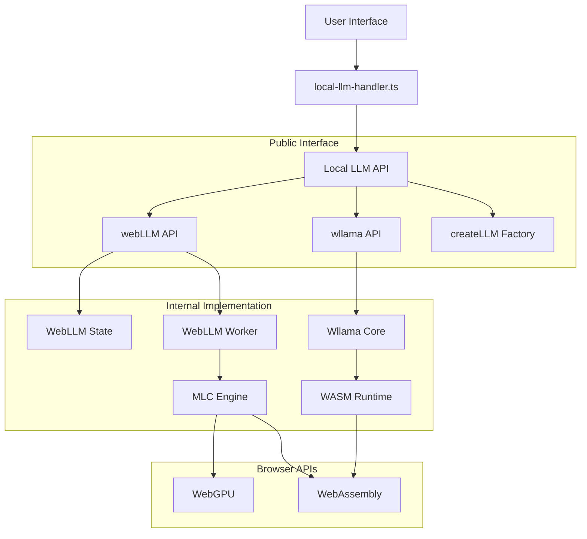

# Local LLM Service Documentation

## Overview

The Local LLM Service provides a unified, OpenAI-compatible interface for running language models locally in the browser. It supports two providers:

- **WebLLM**: Browser-based LLM inference using WebGPU/WebAssembly
- **Wllama**: Lightweight WASM-based LLM inference

## Architecture

### System Overview



### Directory Structure

```
src/services/local-llm/         # 🎯 Public OpenAI-compatible API
├── types/                      # Type definitions
│   ├── openai-compatible.ts    # OpenAI API types
│   └── llm-service.ts          # Internal service types
└── index.ts                    # Clean exports only

src/services/webllm/            # Internal WebLLM implementation
├── api.ts                      # Clean API wrapper
├── state/                      # Zustand state management
├── worker/                     # Web Worker implementation
├── utils/                      # Utilities and helpers
└── index.ts                    # Internal exports

src/services/wllama/            # Internal Wllama implementation
├── api.ts                      # Clean API wrapper
├── state.ts                    # Simple state management
├── wllama.ts                   # Core implementation
├── wllama-serialize.ts         # Serialization helpers
└── index.ts                    # Internal exports

src/handlers/
└── local-llm-handler.ts        # Handler integration
```

### Data Flow Diagram


### Component Interaction


### API Surface Design


## Quick Start

### Basic Usage

```typescript
import { webLLM, wllama } from 'src/services/local-llm'

// Load a model
await webLLM.loadModel('Llama-3.2-1B-Instruct-q4f32_1-MLC')
await wllama.loadModel('microsoft/DialoGPT-medium')

// Chat completion (identical interface)
const response = await webLLM.chatCompletion(messages, { stream: true })
const response = await wllama.chatCompletion(messages, { stream: true })
```

### Factory Pattern

```typescript
import { createLLM } from 'src/services/local-llm'

const llm = createLLM('webllm') // or 'wllama'
await llm.loadModel('model-name')
const response = await llm.chatCompletion(messages, options)
```

## API Reference

### Core Interface

Both `webLLM` and `wllama` implement the same interface:

```typescript
interface LocalLLMAPI {
  // Model management
  loadModel(modelName: string): Promise<void>
  unloadModel(): Promise<void>
  getCurrentModel?(): Promise<string | undefined>
  
  // Chat completion - OpenAI compatible
  chatCompletion(
    messages: BaseMessage[],
    options?: ChatCompletionOptions
  ): Promise<ChatCompletionResponse> | AsyncGenerator<ChatCompletionStreamChunk>
}
```

### Chat Completion Options

```typescript
interface ChatCompletionOptions {
  // Core parameters
  model?: string
  stream?: boolean              // Default: true
  temperature?: number
  max_tokens?: number
  
  // Structured output (OpenAI compatible)
  response_format?: {
    type: 'json_object'
    schema: Record<string, any>
  }
  
  // Function calling (OpenAI compatible)
  tools?: {
    type: 'function'
    function: {
      name: string
      description: string
      parameters: Record<string, any>
    }
  }[]
}
```

### Response Types

**Streaming Response:**
```typescript
interface ChatCompletionStreamChunk {
  content: string
  chunk: any
}
```

**Non-Streaming Response:**
```typescript
interface ChatCompletionResponse {
  content: string
  usage?: {
    prompt_tokens?: number
    completion_tokens?: number
    total_tokens?: number
  }
  tool_calls?: Array<{
    name: string
    args: Record<string, any>
  }>
}
```

## Usage Examples

### 1. Basic Chat

```typescript
import { webLLM } from 'src/services/local-llm'
import { HumanMessage } from '@langchain/core/messages'

await webLLM.loadModel('Llama-3.2-1B-Instruct-q4f32_1-MLC')

const messages = [new HumanMessage('Hello, how are you?')]
const response = await webLLM.chatCompletion(messages, { stream: false })

console.log(response.content)
```

### 2. Streaming Chat

```typescript
const messages = [new HumanMessage('Tell me a story')]
const stream = await webLLM.chatCompletion(messages, { stream: true })

for await (const chunk of stream as AsyncGenerator<any>) {
  console.log(chunk.content)
}
```

### 3. Structured Output (WebLLM only)

```typescript
const jsonSchema = {
  type: 'object',
  properties: {
    name: { type: 'string' },
    age: { type: 'number' }
  },
  required: ['name', 'age']
}

const response = await webLLM.chatCompletion(messages, {
  response_format: { type: 'json_object', schema: jsonSchema }
})

console.log(JSON.parse(response.content))
```

### 4. Function Calling (WebLLM only)

```typescript
const tools = [{
  type: 'function',
  function: {
    name: 'get_weather',
    description: 'Get current weather',
    parameters: {
      type: 'object',
      properties: {
        location: { type: 'string' }
      },
      required: ['location']
    }
  }
}]

const response = await webLLM.chatCompletion(messages, { tools })
```

## Provider Comparison

| Feature | WebLLM | Wllama |
|---------|---------|---------|
| **Performance** | High (WebGPU) | Medium (WASM) |
| **Model Support** | MLC models | HuggingFace models |
| **Structured Output** | ✅ Yes | ❌ Not yet |
| **Function Calling** | ✅ Yes | ❌ Not yet |
| **Memory Usage** | Higher | Lower |
| **Setup Complexity** | Medium | Low |
| **Browser Support** | Modern browsers | All browsers |

## Model Loading

### WebLLM Models

WebLLM supports MLC-compiled models:

```typescript
await webLLM.loadModel('Llama-3.2-1B-Instruct-q4f32_1-MLC')
await webLLM.loadModel('Phi-3.5-mini-instruct-q4f16_1-MLC')
await webLLM.loadModel('Qwen2.5-0.5B-Instruct-q4f32_1-MLC')
```

### Wllama Models

Wllama supports HuggingFace models:

```typescript
await wllama.loadModel('microsoft/DialoGPT-medium')
await wllama.loadModel('ggml-org/gemma-2-2b-it-Q4_K_M-GGUF')
```

## Error Handling

```typescript
try {
  await webLLM.loadModel('invalid-model')
} catch (error) {
  console.error('Failed to load model:', error.message)
}

try {
  const response = await wllama.chatCompletion(messages, {
    response_format: { type: 'json_object', schema: {} }
  })
} catch (error) {
  console.error('Structured output not supported:', error.message)
}
```

## Integration with Handler

The service integrates with the existing handler system:

```typescript
import { localLLMHandler } from 'src/handlers/local-llm-handler'

const result = await localLLMHandler.chatCompletion(messages, {
  schemas: [schema],           // For structured output
  tools: [tool],              // For function calling
  llm: { provider: 'WebLLM' }, // Provider selection
  onMessageUpdate: (data) => { /* handle streaming */ },
  onMessageFinish: (data) => { /* handle completion */ }
})
```

## Type Definitions

```typescript
// Import types
import type {
  ChatCompletionOptions,
  ChatCompletionResponse,
  ChatCompletionStreamChunk,
  ChatCompletionMessage
} from 'src/services/local-llm'

// Usage in components
const handleChat = async (
  messages: BaseMessage[],
  options: ChatCompletionOptions
): Promise<ChatCompletionResponse> => {
  return await webLLM.chatCompletion(messages, { ...options, stream: false })
}
```

## Best Practices

### 1. Model Management

```typescript
// Always unload before loading new model
await webLLM.unloadModel()
await webLLM.loadModel('new-model')

// Check current model
const currentModel = await webLLM.getCurrentModel()
if (!currentModel) {
  await webLLM.loadModel('default-model')
}
```

### 2. Memory Management

```typescript
// Cleanup on component unmount
useEffect(() => {
  return () => {
    webLLM.unloadModel()
    wllama.unloadModel()
  }
}, [])
```

### 3. Error Recovery

```typescript
const chatWithRetry = async (messages: BaseMessage[], maxRetries = 3) => {
  for (let i = 0; i < maxRetries; i++) {
    try {
      return await webLLM.chatCompletion(messages)
    } catch (error) {
      if (i === maxRetries - 1) throw error
      console.warn(`Attempt ${i + 1} failed, retrying...`)
      await new Promise(resolve => setTimeout(resolve, 1000))
    }
  }
}
```

### 4. Streaming Best Practices

```typescript
const handleStreamingResponse = async (messages: BaseMessage[]) => {
  let content = ''
  const stream = await webLLM.chatCompletion(messages, { stream: true })
  
  try {
    for await (const chunk of stream as AsyncGenerator<any>) {
      content += chunk.content || ''
      // Update UI incrementally
      updateUI(content)
    }
  } catch (error) {
    console.error('Streaming error:', error)
    // Fallback to accumulated content
    return content
  }
}
```

## Performance Optimization

### 1. Model Preloading

```typescript
// Preload models on app startup
const initializeModels = async () => {
  try {
    await Promise.all([
      webLLM.loadModel('Llama-3.2-1B-Instruct-q4f32_1-MLC'),
      wllama.loadModel('microsoft/DialoGPT-medium')
    ])
  } catch (error) {
    console.warn('Model preloading failed:', error)
  }
}
```

### 2. Connection Pooling

```typescript
// Use factory pattern for multiple instances
const createLLMPool = (provider: 'webllm' | 'wllama', size = 2) => {
  const pool = Array(size).fill(null).map(() => createLLM(provider))
  return pool
}
```

### 3. Request Batching

```typescript
const batchRequests = async (requests: Array<{messages: BaseMessage[], options?: ChatCompletionOptions}>) => {
  return Promise.all(
    requests.map(req => webLLM.chatCompletion(req.messages, req.options))
  )
}
```

## Troubleshooting

### Common Issues

1. **Model Loading Fails**
   ```typescript
   // Check browser compatibility
   if (!navigator.gpu) {
     console.warn('WebGPU not supported, consider using Wllama')
   }
   ```

2. **Memory Issues**
   ```typescript
   // Monitor memory usage
   if (performance.memory.usedJSHeapSize > 1e9) {
     await webLLM.unloadModel()
   }
   ```

3. **Streaming Interruption**
   ```typescript
   // Handle stream interruption
   const controller = new AbortController()
   try {
     const stream = await webLLM.chatCompletion(messages, { 
       stream: true,
       signal: controller.signal 
     })
   } catch (error) {
     if (error.name === 'AbortError') {
       console.log('Stream was cancelled')
     }
   }
   ```

### Debug Mode

```typescript
// Enable debug logging (if available)
const debugResponse = await webLLM.chatCompletion(messages, {
  debug: true,
  stream: true
})
```

## Migration Guide

### From State-Based to Clean API

**Before:**
```typescript
const state = useWebLLMState()
await state.loadModel('model', { provider: 'WebLLM' })
const response = state.chatCompletion(messages, options)
```

**After:**
```typescript
await webLLM.loadModel('model')
const response = await webLLM.chatCompletion(messages, options)
```

### Handler Integration

The handler automatically uses the new clean API while maintaining backward compatibility with existing code.

## Contributing

When extending the Local LLM service:

1. **Maintain OpenAI Compatibility**: Follow OpenAI API standards
2. **Keep Interface Identical**: Both providers should work the same way  
3. **Add Type Safety**: Full TypeScript support required
4. **Update Documentation**: Keep this guide current
5. **Add Tests**: Ensure reliability

## License

This Local LLM implementation is part of the NoLLMChat project and follows the same license terms.